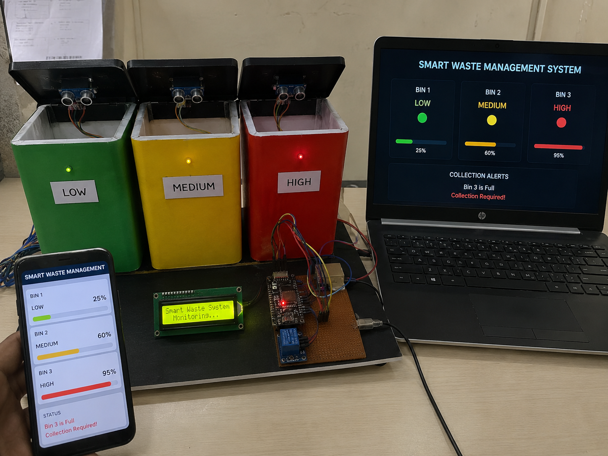

# IoT-Based Smart Waste Management System

A real-time garbage bin monitoring system built with an ESP32, ultrasonic sensors, an I2C LCD, and a built-in Wi-Fi web dashboard — designed to reduce overflowing bins and optimize waste collection routes for smart city applications.




---

## Overview

Traditional waste collection relies on fixed schedules regardless of how full a bin actually is — leading to overflowing bins, unnecessary collection trips, and wasted fuel. This project uses ultrasonic distance sensors mounted above three waste bins to continuously measure fill level in real time.

Each bin's status is classified as **LOW**, **MEDIUM**, or **HIGH** based on how full it is. The system displays live readings on a 16x2 LCD, triggers a local alert (relay/buzzer/LED) when a bin is full, and hosts a Wi-Fi web dashboard so fill levels can be checked remotely from a phone or laptop — just like the "Smart Waste Management System" dashboard shown in the project photos.

## Key Features

- 🗑️ **Real-Time Fill-Level Monitoring** for 3 separate bins
- 📡 **Built-In Wi-Fi Web Dashboard** (auto-refreshing HTML + JSON API)
- 🔔 **Automatic Alert** when a bin reaches the "Full" threshold
- 📟 **LCD Display** cycling through live bin status
- 💰 **Low Cost and Scalable** — add more bins by adding more sensors

## Working Principle

An ultrasonic sensor mounted above each bin measures the distance to the waste inside. As the garbage level rises, the measured distance decreases. This distance is converted into a fill percentage and compared against threshold values to classify the bin as LOW, MEDIUM, or HIGH (full).

```
ULTRASONIC SENSOR → DISTANCE MEASUREMENT → FILL % CALCULATION → STATUS (LOW / MEDIUM / HIGH)
                                                     ↓
                                    LCD DISPLAY + WEB DASHBOARD + ALERT
```

## Hardware Components

| Component                  | Purpose                                   |
|------------------------------|---------------------------------------------|
| HC-SR04 Ultrasonic Sensor ×3 | Detects garbage fill level in each bin     |
| ESP32 Dev Board             | Processes sensor data + Wi-Fi connectivity |
| 16x2 I2C LCD Display        | Displays live bin status                   |
| Relay / Buzzer / LED Module | Bin-full alert notification                |
| Breadboard                  | Prototype circuit assembly                 |
| Jumper Wires                | Circuit connections                        |
| Power Supply                | System power source                        |

## Circuit Connections

**Bin 1 — HC-SR04 Ultrasonic Sensor**

| Sensor Pin | ESP32 Pin |
|------------|-----------|
| VCC  | 5V |
| GND  | GND |
| TRIG | GPIO 5 |
| ECHO | GPIO 18 |

**Bin 2 — HC-SR04 Ultrasonic Sensor**

| Sensor Pin | ESP32 Pin |
|------------|-----------|
| VCC  | 5V |
| GND  | GND |
| TRIG | GPIO 19 |
| ECHO | GPIO 21 |

**Bin 3 — HC-SR04 Ultrasonic Sensor**

| Sensor Pin | ESP32 Pin |
|------------|-----------|
| VCC  | 5V |
| GND  | GND |
| TRIG | GPIO 22 |
| ECHO | GPIO 23 |

**16x2 I2C LCD**

| LCD Pin | ESP32 Pin |
|---------|-----------|
| SDA | GPIO 21 |
| SCL | GPIO 22 |
| VCC | 5V |
| GND | GND |

**Relay / Buzzer / LED (Bin Full Alert)**

| Pin | ESP32 Pin |
|-----|-----------|
| IN  | GPIO 4 |
| VCC | 5V |
| GND | GND |

> ⚠️ **Pin conflict note:** the example wiring above reuses GPIO 21/22 for both the LCD's I2C bus and two of the ultrasonic sensors, purely as a placeholder layout. On your actual build, assign any free GPIO pairs to each ultrasonic sensor's TRIG/ECHO so they don't clash with your LCD's SDA/SCL lines, then update the pin constants at the top of the sketch to match your wiring.

## Software Requirements

- [Arduino IDE](https://www.arduino.cc/en/software)
- **ESP32 board package** — install via *File → Preferences → Additional Board Manager URLs* and add the Espressif ESP32 package, then install "esp32" in Boards Manager
- **LiquidCrystal_I2C** library — install via *Sketch → Include Library → Manage Libraries*
- `WiFi.h` and `WebServer.h` (included automatically with the ESP32 core)

## Getting Started

1. Wire the circuit according to the connections tables above.
2. Install the ESP32 board package and the `LiquidCrystal_I2C` library.
3. Open `Smart_Waste_Management_System.ino` in the Arduino IDE.
4. Update the Wi-Fi credentials near the top of the sketch:
   ```cpp
   const char* WIFI_SSID     = "YOUR_WIFI_SSID";
   const char* WIFI_PASSWORD = "YOUR_WIFI_PASSWORD";
   ```
5. Update `BIN_HEIGHT_CM` to match the physical height of your bins (distance from sensor to empty bin floor).
6. Select **Board: ESP32 Dev Module** and the correct COM port, then upload.
7. Open the Serial Monitor at **115200 baud** to find the ESP32's assigned IP address.
8. Visit that IP address in a browser on the same Wi-Fi network to view the live dashboard.

## Calibration

Fill-level classification is based on the bin's empty-to-full distance range:

```cpp
const float BIN_HEIGHT_CM = 30.0;   // distance (cm) from sensor to empty bin floor
const int THRESHOLD_MEDIUM = 50;    // >= 50% fill = MEDIUM
const int THRESHOLD_HIGH   = 85;    // >= 85% fill = HIGH / FULL
```

Adjust `BIN_HEIGHT_CM` to your actual bin depth, and tune the thresholds to suit how early you want alerts to trigger.

## Sample LCD Output

```
BIN 1: LOW
Level: 25%
```

```
BIN 3: HIGH
Level: 95%
```

## Web Dashboard

The ESP32 hosts two endpoints on the local network:

- `GET /` — auto-refreshing HTML dashboard showing all three bins with status colors and fill bars
- `GET /data` — JSON endpoint for integrating with a mobile app or external dashboard, e.g.:
  ```json
  {"bin1":{"percent":25,"status":"LOW"},"bin2":{"percent":60,"status":"MEDIUM"},"bin3":{"percent":95,"status":"HIGH"}}
  ```

## Limitations

- Sensor performance may be affected by moisture or dust.
- Requires a stable power supply and Wi-Fi connectivity.
- Limited range depending on ultrasonic sensor specifications.
- Requires proper sensor calibration for accurate fill percentages.

## Future Enhancements

- Mobile application integration
- GPS-based waste collection tracking
- AI-based waste analytics
- Cloud data storage
- Solar-powered smart bins
- Automatic route optimization
- Integration with smart city dashboards

## Applications

- Smart city waste management
- Public garbage monitoring systems
- Municipal waste collection systems
- College and campus waste monitoring
- Industrial waste management

## License

This project is released under the MIT License.

```
MIT License

Copyright (c) 2025 Srinivasan G

Permission is hereby granted, free of charge, to any person obtaining a copy
of this software and associated documentation files (the "Software"), to deal
in the Software without restriction, including without limitation the rights
to use, copy, modify, merge, publish, distribute, sublicense, and/or sell
copies of the Software, and to permit persons to whom the Software is
furnished to do so, subject to the following conditions:

The above copyright notice and this permission notice shall be included in all
copies or substantial portions of the Software.

THE SOFTWARE IS PROVIDED "AS IS", WITHOUT WARRANTY OF ANY KIND, EXPRESS OR
IMPLIED, INCLUDING BUT NOT LIMITED TO THE WARRANTIES OF MERCHANTABILITY,
FITNESS FOR A PARTICULAR PURPOSE AND NONINFRINGEMENT. IN NO EVENT SHALL THE
AUTHORS OR COPYRIGHT HOLDERS BE LIABLE FOR ANY CLAIM, DAMAGES OR OTHER
LIABILITY, WHETHER IN AN ACTION OF CONTRACT, TORT OR OTHERWISE, ARISING FROM,
OUT OF OR IN CONNECTION WITH THE SOFTWARE OR THE USE OR OTHER DEALINGS IN THE
SOFTWARE.
```

## Author

**Srinivasan G**
Biomedical Engineering — April 2025
